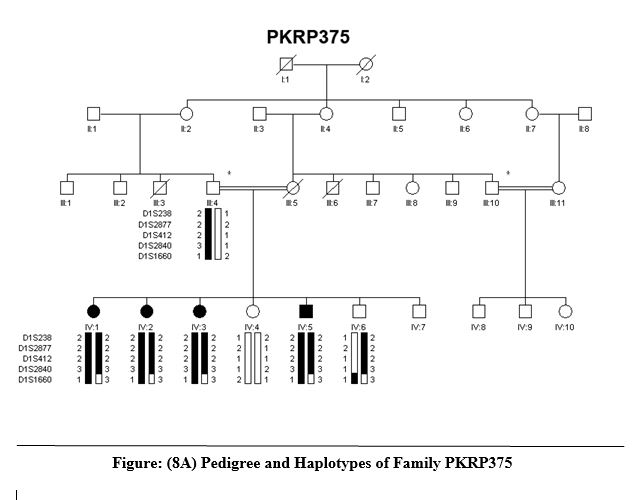
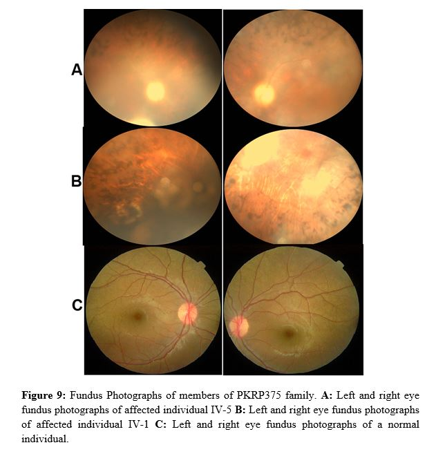

# Vision Impairment
### Retinitis Pigmentosa: Genetic Insights and Implications

Retinitis Pigmentosa (RP) encompasses a group of inherited retinal disorders characterized by abnormalities in photoreceptors or the retinal pigment epithelium (RPE), leading to progressive vision loss. Patients typically experience night blindness, peripheral visual field constriction, and eventual complete blindness. RP exhibits diverse inheritance patterns, including autosomal dominant, autosomal recessive, X-linked, mitochondrial, and complex genetic modes, complicating genetic testing, counseling, and therapeutic interventions.

This study investigated four families with autosomal recessive inheritance, focusing on linkage to common loci prevalent in the Pakistani population. One family (PKRP375) demonstrated linkage to the CRB1 gene, which encodes the crumbs homolog 1 protein, critical for retinal cell development and connectivity. Clinical evaluations, including fundus and ERG examinations, confirmed progressive photoreceptor degeneration. The remaining families showed no linkage to the tested loci.

The study identified carrier statuses within the PKRP375 family, aiding genetic counseling efforts. These findings underscore the importance of enrolling additional families to identify causative RP genes, enabling preventive measures and novel therapeutic strategies.

---

The part of the results presented here are preliminary and have not yet been published. Full disclosure of findings is subject to CEMB-University of the Punjab, Lahore approval and consent. All data has been submitted as M.Phil Thesis (Molecular Biology)

